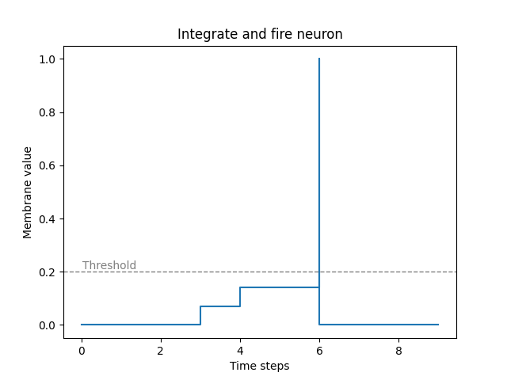
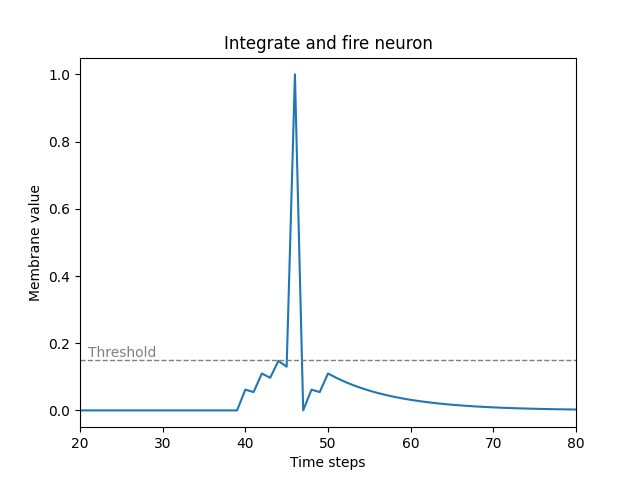

# Spiking Neuron

The *spking neruon* is a digital model, tring to simulate the biological neuron in our brain.
The basic *spiking neuron* model is the *integrate and fire* (IF) model, which is the base point where all other models start.
We can use *"addons"* to change the behaviour (essentially the dynamics) of our neuron model.

// TODO: write down properties of the spiking neuron.

## Neural Network

*Spiking neuron* models are a subset of the *artifical neuron* model, but in the following, I will refer to the conventional *general artifical neuron* as *artifical neurons* and separate them as two groups.

The difference between *spiking neuron* model and the *artifical neuron* model (found in conventional neural networks) is that, spikes are emitted from the *spiking neurons* through time, which are binary signals and they have inner dynamics. *Artificial neurons* however, outputs real value and doesn't take time into account.

When we wire *artifical neurons* together, we create a from of *artifical neural network* (ANN), specifically when we wire *spiking neurons* together we create a *spiking neural network* (SNN).
For example when we give input to an ANN it generates an output right away, and this output only computed from the inputs the network was given (except when we use *recurrent artifical neural networks* (RNN), which uses *"feedback loops"*). An SNN, however when an input is fed to the network, the output might be delayed and it's computed from the network's state and it's input.

> **_NOTE:_** Search for *artifical neuron* to see a visual representation

### Artifical Neuron

The *artifical neuron* is the basic compute unit of an ANN. It has input connections and output conections.
To compute it's output: 

1) Weighted sum up the inputs from the input connections with the connection weights, creating a weighted sum.
2) Then apply the **activation function** on the weighted sum, creating the output of the neuron.
3) Push the output down the output connections, these will be the inputs of the downstream neurons.

Activation functions are the **core** of an *artifical neuron*, without it, the neuron and also any other ANN built from these neurons, would only be able to make linear separation of concepts of the data we give them. But we know that our world isn't linear, so this nonlinear function is a **must**.

> **_NOTE:_** For activation functions search up the tearms *sigmoid* or *RelU*

### Essence of ANNs

Think of ANNs as a complex matematical function (actually **it is** a complex matematical function, that capable of modelling the data it was trained on), when you pass inputs to this function, you get an output from it.  

What is an input/output you might ask?  
Anything. An input can be an image (represented by it's pixel values from 0 to 255 or between 0 to 1, as a *matrix* or *tensor* for RGB values), a datapoint (represented by a *vector*), a word or a sequence of words (represented by a *vector* or *matrix* as in LLMs). The output can be another image or the next word in the sequence, or just a classification value (represented by a *vector*, in which it's values are corresponding to the probability of input beeing that class. Example: input is an image, output it is a dog or a cat).

The output is computed from only the current input (except in RNNs, where also the "state" of the network matters). ANNs usually have well defined structure, such that we group neurons togehter and call them as a **layer** of neurons. We take every neurons from one layer and connect it to every other neurons from the other layer, creating a *feedforward* *artificial neural network*, easily described with **matrices**. We can stack however many layers we want, creating a *deep neural network*.  
To compute the output of the network we set the input as the *"output"* of the first layer, than calculate the next layer's output with the **weight** matrix (representing the connections between the first and the next layer) and the activation function, we continue this process until we get to the last layer. The last layer's output is the network's official output.  
Input and output, usually represented with *vectors* or *matrices* or *tensors*. Every layers can have different activation function.

At this point we understand the basics of ANNs, with **claver** methods, a whole zoo of ANNs can be created, like *recurrent*, *convolutional*, *transformers*, etc. Applying different combinations of layer types, activation functions we can come up with interesting networks.

> **_NOTE:_** Search for *ANN* to see a visual representation of how *artificial neural networks* looks like

*The representation of the ANN in pure matematical form and training them will be discussed in a different chapter.*

### Essence of SNNs

Think of SNN's as a graph of interconnected nodes, which are transmits binary signals to each other, you decide which are the output neurons, and are input neurons. You can *"write"* input signals to the input neurons and *"read"* output signals from the output neurons, but you don't necessary know if the output signal is corresponding to the input signal you just sent to the network, because it might be delayed.
Of course you can still structure the network, such that the signal can only travel from input neurons to output neurons.
So the output signal will always depends on the state of the network and the input.

We can represent input/output signals in different way, some are *rate,-*, *temporal,-*, *latency coding*, later on these.

## IF: Intergrate and Fire Neuron

The most basic form of *spiking neuron* model. It integrates all of it's weighted input throught time and emits a spike when it's membrane potential reaches the threshold.

*Figure 1: Integrate and fire neuron activation model*

## LIF: Leaky Integrate and Fire Neuron

Using the leaky integrate and fire neuron model is a good trade of of resembling the biological neuron and compoutation complexity. It's main property is that the membrane potential exponentially dacaying back to it's *reset* value. With this model we can imagine that this model have a kind of memory property to it.

*Figure 2: Leaky integrate and fire neuron activation model, membrane potential decaying back to the reset value*
